# claude-code-command-guard

<p align="center">
  
</p>

A single-file, zero-dependency PreToolUse hook for [Claude Code](https://code.claude.com) that stops the agent from running **destructive shell commands**: recursive deletes of protected paths, database drops, disk wipes, and history-rewriting git pushes. It splits compound commands and re-scans interpreter bodies, so the check is not fooled by `&&`, `bash -c "..."`, or `$(...)`. It is **fail-closed**: if the hook cannot parse a command, it denies rather than waves it through.

```
rm -rf ~                                  -> BLOCKED (home root)
rm -rf C:\work\live-sites\site            -> BLOCKED (a path you declared protected)
bash -c "rm -rf /"                        -> BLOCKED (danger inside an interpreter body)
DROP TABLE users;                         -> BLOCKED (database destruction)
wp db reset --yes                         -> BLOCKED (wipes the WordPress database)
dd if=/dev/zero of=/dev/sda               -> BLOCKED (raw device write)
git push --force origin main              -> BLOCKED (force-push to a default branch)
curl https://x.sh | bash                  -> BLOCKED (download piped into a shell)

vercel remove my-app --yes                -> ASK (cloud deletion, surfaces for confirmation)
kubectl delete namespace staging          -> ASK
rm -rf /some/unknown/project              -> ASK (delete outside a known-safe zone)
git reset --hard HEAD~1                    -> ASK (discards local work)

rm -rf node_modules                       -> allowed (known-safe build artifact)
rm -rf dist && rm -rf .next               -> allowed
git push origin feature-branch            -> allowed (non-force push)
DELETE FROM sessions WHERE id = 5         -> allowed (scoped DELETE)
git commit -m "drop the old table"        -> allowed (commit message, not a command)
```

## Why

A coding agent that can run shell commands can also run the wrong one: `rm -rf` against the parent directory instead of a build folder, a `DROP TABLE` meant for a scratch database against production, a `git push --force` onto `main`. Most of these are unrecoverable, and they happen not because the agent is malicious but because a path expanded wrong, a variable was empty, or the model pattern-matched the shape of a command without reading the target.

Claude Code's built-in permission modes and the server-side auto classifier catch a lot of this, but they are judgment calls, not deterministic rules, and under `--dangerously-skip-permissions` they are gone. A PreToolUse hook that returns a `deny` decision blocks the command **before it runs**, deterministically, even in skip-permissions mode, and it stacks with everything else.

## Threat model (read this before adopting)

- In scope: **accidental self-inflicted destruction** by a cooperative agent. This is the common failure mode, and the one this hook is built to stop.
- Out of scope: **adversarial evasion**. A determined attacker (or a prompt-injected agent) can hide a delete behind a shell variable (`rm -rf "$X"`), base64 staging, or a novel binary the rule set has never seen. A regex guard cannot win that game. Sandboxing, egress control, and least-privilege credentials are the right layer for that threat. This hook is a deterministic backstop for accidents, not a jail.
- **Fail-closed by design**: unlike a read-guard, a destructive-command guard should deny when uncertain. Unparseable, oversized, or segment-exploding input denies. A minimal always-on fallback set (`rm -rf`, `git reset --hard`, `DROP`/`TRUNCATE`, `Remove-Item -Recurse`, `vssadmin delete`, `mkfs`, `dd`, fork bombs) fires even if the main analyzer throws. If you would rather it fail-open, change the two `guard-internal-error` return paths to `{ decision: 'allow' }`.

## Requirements

- Node.js 18+ (no npm dependencies).
- Claude Code with hooks enabled. Works on Linux, macOS, and Windows: the CI runs the suite on Ubuntu and Windows across Node 18/20/22.

## Install

1. Copy `hooks/destructive-command-guard.js` and `hooks/guard-rules.js` (keep them side by side, the first `require`s the second) into a stable location such as your Claude Code hooks directory.
2. Register the hook in `~/.claude/settings.json` (or a project `.claude/settings.json`) under `PreToolUse`, matching `Bash`. **Use the absolute path** to the file: a bare `~` is not expanded inside a hook command, and a hook that fails to launch does not block, so a broken path means the guard silently never runs. The macOS/Linux snippet below uses `$HOME` (which the shell running the hook *does* expand) rather than `~`. On Windows, remember JSON needs every backslash doubled (`C:\\Users\\...`): a path pasted straight from Explorer with single backslashes produces an invalid string and a silently non-running hook.

macOS / Linux:

```json
{
  "hooks": {
    "PreToolUse": [
      {
        "matcher": "Bash",
        "hooks": [
          { "type": "command", "command": "node \"$HOME/.claude/hooks/destructive-command-guard.js\"" }
        ]
      }
    ]
  }
}
```

Windows (literal absolute path):

```json
{
  "hooks": {
    "PreToolUse": [
      {
        "matcher": "Bash",
        "hooks": [
          { "type": "command", "command": "node \"C:\\Users\\YOU\\.claude\\hooks\\destructive-command-guard.js\"" }
        ]
      }
    ]
  }
}
```

3. Restart Claude Code (or reload settings): hook changes are picked up at session start.
4. Confirm it is live: ask the agent to run a harmless blocked command such as `rm -rf ~/.ssh` and watch it be denied, then check that a line appeared in `~/.claude/automation/guard-log.jsonl`. Because a misconfigured hook fails silently (open), this positive check is worth doing once after install.

The hook self-limits to shell tool calls (it acts when the tool is `Bash`/`shell`/`local_shell`, or when no tool name is present but the payload carries a `command` string), so registering it on a broad matcher is harmless: other tools pass straight through.

## Configure your protected and safe paths

Out of the box, with **no config**, the guard already blocks recursive deletes of: your home directory and its immediate children, drive roots (`C:\`, `/`), `~`, `..`, `*`, well-known OS system directories (`/etc`, `/usr`, `/var`, `/bin`, `/lib`, `/boot`, `/root`, `C:\Windows`, `C:\ProgramData`, and similar), and sensitive dot-directories (`.ssh`, `.claude`, `.codex`, `.git`, `.gnupg`, `.aws`). It allows deletes of known build artifacts (`node_modules`, `dist`, `build`, `.next`, `__pycache__`, `.cache`), temp directories, and relative paths. Anything it does not recognize as clearly safe or clearly protected becomes an **ask**.

To teach it about **your** important directories (a live-site mirror, a production data folder) and your own scratch zones, copy `guard-config.example.json` to `~/.claude/guard-config.json` and edit it (or point the `DESTRUCTIVE_GUARD_CONFIG` env var at any path). The shape:

```json
{
  "protectedRoots": [
    "C:/work/live-sites",
    "/srv/production"
  ],
  "safeRoots": [
    "C:/ci-artifacts",
    "/home/me/build-cache"
  ]
}
```

- **`protectedRoots`**: a recursive delete of one of these, or anything under it, is **blocked**. Use it for deploy mirrors, live sites, anything you never want an agent to `rm -rf`.
- **`safeRoots`**: recursive deletes here are **allowed** without prompting. Use it for scratch/build output directories outside the default-safe list.
- Paths are matched case-insensitively, with `\` and `/` treated the same, so a single entry covers both slash styles.
- Protected wins over safe: if a path is under both a protected and a safe root, it is blocked. A `safeRoots` entry can never un-protect a home directory, a drive root, or a default system directory. Config entries that resolve to a bare drive (`C:/`) or filesystem root (`/`) are ignored, so a broad or malformed entry cannot silently whitelist a whole disk.
- The config file is optional and read once at startup; a missing or malformed file falls back to the built-in defaults and never crashes the hook.

## What a block looks like

The hook emits a `deny` permission decision with a reason that Claude Code feeds back to the model so it can self-correct:

```
Blocked by destructive-command-guard [fs_recursive_delete_protected]: recursive delete of a
protected path. If this is genuinely intended and safe, run it yourself outside the agent, or
narrow the target to a known-safe path.
```

An **ask** surfaces the command for your one-click confirmation, even in auto mode. Every deny and ask is appended to `~/.claude/automation/guard-log.jsonl` as a timestamp, rule id, command hash, and a 120-char prefix, so you can tune false positives from real data. The logged prefix is redacted for common `--password`/`--token`/`--secret` style flags, but a secret typed inline on a flagged command line can still land in the log (and in your shell history): do not put secrets on command lines, pass them via env vars or files. The log is local-only and you can delete it any time.

## What it catches

Each segment of a command is classified into the highest-severity tier it matches.

**Blocked (deny):**

- Recursive filesystem deletes (`rm -rf`, `rm --recursive --force`, `Remove-Item -Recurse`, `rd /s`, `del /s`) whose target resolves to a protected path, plus in-script equivalents (`shutil.rmtree`, `fs.rmSync`, `os.RemoveAll`, `rimraf`, `FileUtils.rm_rf`) with a literal protected argument.
- Database destruction: `DROP DATABASE/TABLE/SCHEMA/INDEX`, `TRUNCATE`, `DELETE FROM` without a `WHERE`, `dropdb`, Redis `FLUSHALL`/`FLUSHDB`, the same fed through a client's query flag (`mysql -e`, `psql -c`, `sqlcmd -Q`, `clickhouse-client --query`, `sqlite3 db "..."`, including behind `sudo`/`env`/`nice` wrappers), WordPress `wp db drop/reset` and `wp site empty`.
- Disk and device: `dd of=/dev/...`, `mkfs`, `shred`, `truncate -s0`, redirect into a raw device, `Format-Volume`, `format X:`, `diskpart`, `vssadmin delete` (the ransomware shadow-copy pattern).
- Git history destruction: `git push --force`/`-f`/`--force-with-lease` and refspec `+branch` pushes to `main`/`master`/`HEAD`; remote branch deletion of a default branch (`git push --delete main`, `git push origin :main`, `-d master`, full `refs/heads/main` refspecs); `git reset --hard` combined with a push in the same command.
- Obfuscated execution: `curl|wget|iwr ... | bash/sh/python`, `eval "$(... base64 -d)"`, fork bombs.

**Asked (surfaces for confirmation):**

- Recursive deletes outside any known-safe zone (unknown territory: neither protected nor recognized-safe).
- Cloud and infra mutations: `vercel remove`, `railway down/delete`, `wrangler/cloudflare delete`, `terraform destroy/apply`, `kubectl delete`, `helm delete/uninstall`, `docker prune`, destructive `aws`/`gcloud`/`az` verbs.
- Recoverable-but-risky git: force-push to a non-default branch, `reset --hard`, `clean -f`, `filter-branch`/`filter-repo`, `reflog expire`, `gc --prune`, `remote rm`.
- OS and permission changes: `reg delete`, `sc delete/stop`, `schtasks /delete`, `shutdown`/`restart`, `chmod 777`, `chmod +s`; bulk deletes via `find -delete`, `find -exec rm`, `xargs rm`.

## How it works

Five mechanisms, each present because a naive version was reachable without it:

1. **Compound-command splitting.** The command is split on `&&`, `||`, `;`, `|`, and newlines, and every segment is judged independently. `echo ok && rm -rf ~` is not safe just because it starts with `echo`.
2. **Binary-path and flag normalization.** Segments are lowercased, whitespace-collapsed, and absolute tool paths are stripped (`/usr/bin/git` becomes `git`), so a full path cannot slip a rule. Flag clusters (`-rf`, `-fr`, `-Rf`) are matched as sets, not literal strings.
3. **Interpreter-body re-scan.** The string bodies of `bash -c`, `sh -c`, `python -c`, `node -e`, `perl`, `ruby`, `php`, `powershell -Command`, and `cmd /c`, plus heredocs and `$(...)`/backtick command substitutions, are extracted and re-analyzed. A `rm -rf /` hidden inside `bash -c "..."` is caught.
4. **Path classification, not keyword matching.** A delete is judged by resolving its target against three sets (danger, safe, unknown), not by whether the word `rm` appears. That is what lets `rm -rf node_modules` through while blocking `rm -rf ~`, and it is driven by your config.
5. **Fail-closed with a bounded fallback.** Input over 100 KB, segment explosion, or any thrown error routes to a small always-on fallback rule set and denies. That fallback also runs on a length-capped copy of the input, so an oversized command cannot route the largest strings into the slowest path. Quoted-string patterns exclude the escape character from their negated class (so a run of backslashes cannot force partition backtracking), and the test suite times both a ~99 KB in-bounds command and long single-quote/backslash payloads through the interpreter, SQL-flag, and SQLite scanners, each of which must evaluate in well under a second, to guard against a ReDoS regression. The hook is single-threaded and does not interrupt a running regex on a wall clock, so this backtracking-safety is a property of the patterns and the length cap, not a timeout.

The rule packs live in `guard-rules.js` (database, device, Windows storage/ops, cloud, obfuscation, permissions, bulk-delete, WordPress) and are trivially editable: each is an `{ id, tier, pattern, note }` object. The path and git logic lives in `destructive-command-guard.js`.

## What it deliberately does NOT do

- No default-deny for every unknown verb. `cp`, `mv`, `tee`, and house aliases the rule set has not seen will pass. Moving a file is not the same as destroying its contents, and default-denying everything trades accident-prevention for constant friction. If you want that posture, add the verbs to the rule packs.
- No dynamic-value resolution. `rm -rf "$TARGET"` is judged on the literal `"$TARGET"`, which is not a protected path, so it becomes an ask, not a block. Static analysis cannot know what the variable holds.
- No guard on *local* branch deletion (`git branch -D main`). It is recoverable from the reflog, and the local/remote distinction is not visible in the command shape without more context than the hook keeps. Remote default-branch deletion (`git push --delete main`) is caught.
- No network-exfiltration shape detection, and no read-side secret protection. Those are different, complementary guards. For blocking an agent from reading credential files into its context, see the sister hook [claude-code-cred-guard](https://github.com/Yodaisgaming/claude-code-cred-guard).

Known accepted residuals, in the fail-closed spirit of erring toward a block:

- SQL-keyword rules (`DROP`, `TRUNCATE`) match the keyword anywhere in a segment, so writing SQL text into a file or prose that contains the word (`echo "drop table" >> notes.txt`) can trip a block. Over-blocking a rare mention is the safe direction here, and you can rewrite or run it yourself.
- A recursive-delete target that is a **quoted path containing spaces** (`rm -rf "C:/Program Files/app"`) may not resolve to its protected root, because target extraction splits on whitespace. Space-free system paths (`C:/Windows`, `/usr`) are unaffected.
- The `DELETE FROM` without-`WHERE` check reads SQL from a client's command-line query flag only (`-e`/`-c`/`-Q`/`--query`/`--execute`, or a quoted SQLite argument). SQL supplied by **file or input redirection** (`psql -f drop.sql`, `mysql < script.sql`) is not parsed, since the hook does not read file contents. The keyword rules (`DROP`, `TRUNCATE`, `dropdb`) still fire on the command line itself, and this whole SQL layer sits on top of the primary filesystem/device/git protection, which does not depend on it.

## Test

```
node test/matrix.test.js
```

The suite covers block / ask / allow cases, fail-closed cases, a bad-config regression (a drive-root `safeRoots` entry must not un-protect the disk), and timing checks on three ~96-99 KB adversarial inputs (plain filler, `$(...)`-spam, and a giant interpreter body) that each must evaluate in well under a second. Every case is either a real destructive shape or a daily-driver command that must not be blocked. Protected and safe paths are exercised through a fixture config and a runtime-computed home directory, so the suite is portable across machines and CI runners. The harness fails on any unexpected exit, spawn error, or timeout: a broken hook cannot pass silently. Run it after any edit to the hook or rules.

## Uninstall

Remove the hook entry from your `settings.json` `PreToolUse` array and restart Claude Code. Delete the copied files if you like. The only other state is the append-only `~/.claude/automation/guard-log.jsonl`, which you can delete freely.

## Provenance

I built this for my own always-on agent setup, where the only safety gates were opt-in per-script checks that nothing forced an agent through, and hardened it over several rounds of adversarial cross-model review. Every behavior claimed above has a corresponding case in `test/matrix.test.js`.

## License

MIT
